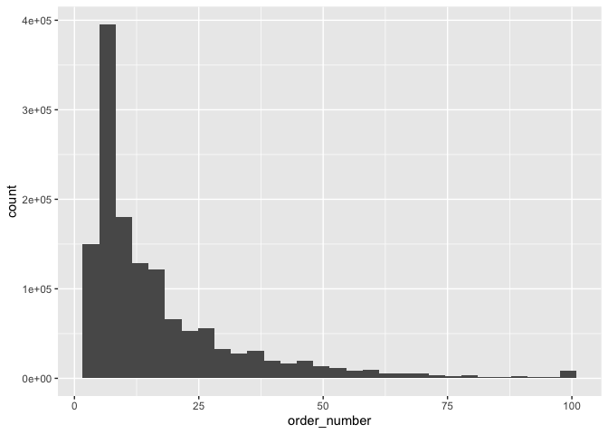
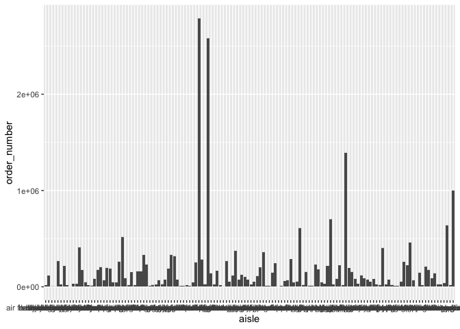
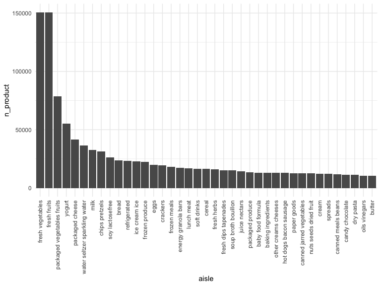
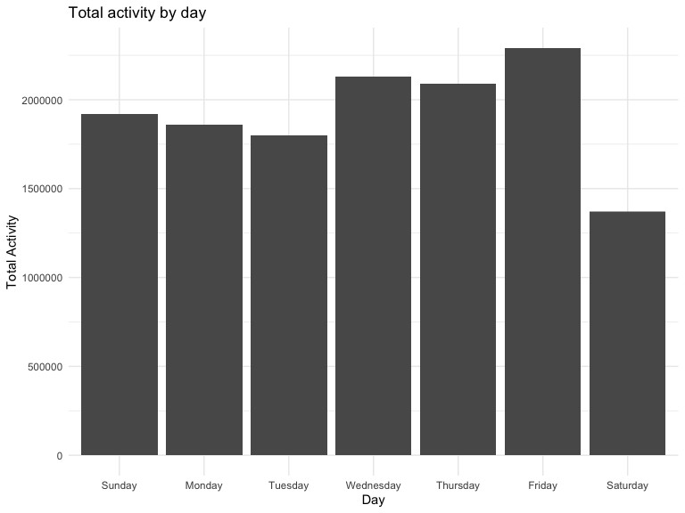

p8105_hw3_ms6360
================
Maisie Sun
2022-10-08

# Problem 1

``` r
library(p8105.datasets)
data("instacart")

colnames(instacart)
```

    ##  [1] "order_id"               "product_id"             "add_to_cart_order"     
    ##  [4] "reordered"              "user_id"                "eval_set"              
    ##  [7] "order_number"           "order_dow"              "order_hour_of_day"     
    ## [10] "days_since_prior_order" "product_name"           "aisle_id"              
    ## [13] "department_id"          "aisle"                  "department"

*Write a short description of the dataset, noting the size and structure
of the data, describing some key variables, and giving illstrative
examples of observations.*

-   This dataset is called `instacart` and has 1384617 rows and 15
    columns.

-   Variables in this dataset (order_id, product_id, add_to_cart_order,
    reordered, user_id, eval_set, order_number, order_dow,
    order_hour_of_day, days_since_prior_order, product_name, aisle_id,
    department_id, aisle, department) include information on items added
    to cart, their aisle location, and product type.

-   Illstrative examples include histograms and bar plots:

``` r
ggplot(instacart, aes(x = order_number)) + 
  geom_histogram()
```

    ## `stat_bin()` using `bins = 30`. Pick better value with `binwidth`.

<!-- -->

``` r
ggplot(instacart, aes(x = aisle, y = order_number)) +
  geom_bar(stat = "identity")
```

<!-- -->

*Why did you use these plots!!*

*How many aisles are there, and which aisles are the most items ordered
from?*

-   There are 134 aisles and top 3 aisles for most items ordered from
    are fresh vegetables, fresh fruits, and packaged vegetables fruits.

``` r
instacart %>%
  select(aisle_id, aisle) %>% 
  group_by(aisle) %>% 
  summarize(n_product = n()) %>% 
  arrange(desc(n_product))
```

    ## # A tibble: 134 × 2
    ##    aisle                         n_product
    ##    <chr>                             <int>
    ##  1 fresh vegetables                 150609
    ##  2 fresh fruits                     150473
    ##  3 packaged vegetables fruits        78493
    ##  4 yogurt                            55240
    ##  5 packaged cheese                   41699
    ##  6 water seltzer sparkling water     36617
    ##  7 milk                              32644
    ##  8 chips pretzels                    31269
    ##  9 soy lactosefree                   26240
    ## 10 bread                             23635
    ## # … with 124 more rows

*Make a plot that shows the number of items ordered in each aisle,
limiting this to aisles with more than 10000 items ordered. Arrange
aisles sensibly, and organize your plot so others can read it.*

``` r
instacart %>%
  group_by(aisle) %>%
  summarize(n_product = n()) %>%
  filter(n_product > 10000) %>%
  mutate(aisle = reorder(aisle, -n_product)) %>% 
  ggplot(aes(x = aisle, y = n_product)) +
  geom_bar(stat = "identity") + 
  theme(axis.text.x = element_text(angle = 90, vjust = 0.5, hjust = 1))
```

<!-- -->

*Make a table showing the three most popular items in each of the aisles
“baking ingredients”, “dog food care”, and “packaged vegetables fruits”.
Include the number of times each item is ordered in your table.*

``` r
instacart %>%
  filter(aisle %in% c("baking ingredients", "dog food care", "packaged vegetables fruits")) %>%
  group_by(aisle, product_name) %>%
  summarize(product_n = n()) %>%
  arrange(desc(product_n)) %>%
  group_by(aisle) %>%
  slice(1:3)
```

    ## `summarise()` has grouped output by 'aisle'. You can override using the
    ## `.groups` argument.

    ## # A tibble: 9 × 3
    ## # Groups:   aisle [3]
    ##   aisle                      product_name                                produ…¹
    ##   <chr>                      <chr>                                         <int>
    ## 1 baking ingredients         Light Brown Sugar                               499
    ## 2 baking ingredients         Pure Baking Soda                                387
    ## 3 baking ingredients         Cane Sugar                                      336
    ## 4 dog food care              Snack Sticks Chicken & Rice Recipe Dog Tre…      30
    ## 5 dog food care              Organix Chicken & Brown Rice Recipe              28
    ## 6 dog food care              Small Dog Biscuits                               26
    ## 7 packaged vegetables fruits Organic Baby Spinach                           9784
    ## 8 packaged vegetables fruits Organic Raspberries                            5546
    ## 9 packaged vegetables fruits Organic Blueberries                            4966
    ## # … with abbreviated variable name ¹​product_n

*Make a table showing the mean hour of the day at which Pink Lady Apples
and Coffee Ice Cream are ordered on each day of the week; format this
table for human readers (i.e. produce a 2 x 7 table).*

``` r
instacart %>%
  filter(product_name %in% c("Pink Lady Apples", "Coffee Ice Cream")) %>%
  select(product_name, order_hour_of_day, order_dow) %>%
  group_by(product_name, order_dow) %>%
  summarize( 
    mean_order = mean(order_hour_of_day)) %>%
  mutate(order_dow = recode(order_dow, "0" = "Sunday", "1" = "Monday", "2" = "Tuesday", "3" = "Wednesday", "4" = "Thursday", "5" = "Friday", "6" = "Saturday")) %>%
  pivot_wider(
    names_from = "order_dow", 
    values_from = "mean_order"
  )
```

    ## `summarise()` has grouped output by 'product_name'. You can override using the
    ## `.groups` argument.

    ## # A tibble: 2 × 8
    ## # Groups:   product_name [2]
    ##   product_name     Sunday Monday Tuesday Wednesday Thursday Friday Saturday
    ##   <chr>             <dbl>  <dbl>   <dbl>     <dbl>    <dbl>  <dbl>    <dbl>
    ## 1 Coffee Ice Cream   13.8   14.3    15.4      15.3     15.2   12.3     13.8
    ## 2 Pink Lady Apples   13.4   11.4    11.7      14.2     11.6   12.8     11.9

# Problem 2

Import and clean the dataset

*Load, tidy, and otherwise wrangle the data. Your final dataset should
include all originally observed variables and values; have useful
variable names; include a weekday vs weekend variable; and encode data
with reasonable variable classes. Describe the resulting dataset
(e.g. what variables exist, how many observations, etc).*

``` r
accel = 
  read_csv("./data/accel_data.csv") %>%
    janitor::clean_names() %>%
  mutate(
    weekend_weekday = ifelse(day %in% c("Sunday", "Saturday"), "Weekend","Weekday"),
    week = as.integer(week),
    day_id = as.integer(day_id)) %>%
  select(week, day_id, weekend_weekday, day, everything())
```

    ## Rows: 35 Columns: 1443
    ## ── Column specification ────────────────────────────────────────────────────────
    ## Delimiter: ","
    ## chr    (1): day
    ## dbl (1442): week, day_id, activity.1, activity.2, activity.3, activity.4, ac...
    ## 
    ## ℹ Use `spec()` to retrieve the full column specification for this data.
    ## ℹ Specify the column types or set `show_col_types = FALSE` to quiet this message.

-   There are 35 rows and 1444 columns in this dataset. Variables
    include Day ID, Week Number, and Activities 1 to 1440.

*Traditional analyses of accelerometer data focus on the total activity
over the day. Using your tidied dataset, aggregate across minutes to
create a total activity variable for each day, and create a table
showing these totals. Are any trends apparent?*

``` r
accel_activity =
  accel %>%
  mutate(
    total_activity = rowSums(.[5:1444])) %>%
  select(week, day_id, weekend_weekday, day, total_activity) %>%
  mutate(day = factor(day, levels = c('Sunday', 'Monday', 'Tuesday', 'Wednesday', 'Thursday','Friday', 'Saturday')))

 ggplot(accel_activity, aes(x = day, y = total_activity)) +
   geom_bar(stat = "identity") + 
   labs(
    title = "Total activity by day",
    x = "Day",
    y = "Total Activity")
```

<!-- -->

-   According to the plot, there is least activity time on Saturday and
    most on Friday. The top 3 days with most activities are Wednesday,
    Thursday, and Friday.

*Accelerometer data allows the inspection activity over the course of
the day. Make a single-panel plot that shows the 24-hour activity time
courses for each day and use color to indicate day of the week. Describe
in words any patterns or conclusions you can make based on this graph.*

``` r
plot = 
  accel %>%
  pivot_longer(
    activity_1:activity_1440,
    names_to = "activity_time", 
    values_to = "activity"
  ) %>%
   mutate(day = factor(day, levels = c('Sunday', 'Monday', 'Tuesday', 'Wednesday', 'Thursday','Friday', 'Saturday'))) %>%
  ggplot(aes(x = activity_time, y = activity, color = day)) + 
  geom_point(alpha = 0.5) +
  theme(axis.text.x = element_text(angle = 90, vjust = 0.5, hjust = 1))

ggsave("result/plot.pdf", plot, width = 20, height = 10)
```

*Show what is this plot showing (activity projectivies, colors of days
of week)* *analysis: Friday morning / Sunday evening??*

# Problem 3

``` r
library(p8105.datasets)
data("ny_noaa")

ny_noaa
```

    ## # A tibble: 2,595,176 × 7
    ##    id          date        prcp  snow  snwd tmax  tmin 
    ##    <chr>       <date>     <int> <int> <int> <chr> <chr>
    ##  1 US1NYAB0001 2007-11-01    NA    NA    NA <NA>  <NA> 
    ##  2 US1NYAB0001 2007-11-02    NA    NA    NA <NA>  <NA> 
    ##  3 US1NYAB0001 2007-11-03    NA    NA    NA <NA>  <NA> 
    ##  4 US1NYAB0001 2007-11-04    NA    NA    NA <NA>  <NA> 
    ##  5 US1NYAB0001 2007-11-05    NA    NA    NA <NA>  <NA> 
    ##  6 US1NYAB0001 2007-11-06    NA    NA    NA <NA>  <NA> 
    ##  7 US1NYAB0001 2007-11-07    NA    NA    NA <NA>  <NA> 
    ##  8 US1NYAB0001 2007-11-08    NA    NA    NA <NA>  <NA> 
    ##  9 US1NYAB0001 2007-11-09    NA    NA    NA <NA>  <NA> 
    ## 10 US1NYAB0001 2007-11-10    NA    NA    NA <NA>  <NA> 
    ## # … with 2,595,166 more rows

*Write a short description of the dataset, noting the size and structure
of the data, describing some key variables, and indicating the extent to
which missing data is an issue.*

-   There are 2595176 rows and 7 columns. The data has information on
    precipitation, snow, and temperature. They are divided based on
    dates and weather station ID.

-   There are many rows where data is missing, especially for tmax and
    tmin.

*Do some data cleaning. Create separate variables for year, month, and
day. Ensure observations for temperature, precipitation, and snowfall
are given in reasonable units. For snowfall, what are the most commonly
observed values? Why?*

``` r
clean_data = 
  ny_noaa %>%
  janitor::clean_names() %>%
  separate(date, into = c("year", "month", "day"), sep = "-") %>%
  mutate(
    prcp = prcp/10,
    tmax = as.numeric(tmax)/10,
    tmin = as.numeric(tmin)/10,
    month = recode(month, "01" = "January", "02" = "February", "03" = "March", "04" = "April", "05" = "May", "06" = "June", "07" = "July", "08" = "August", "09" = "September", "10" = "October", "11" = "November", "12" = "December"))
```

-   Variables were converted into standard units. `prcp` was measured in
    tenths of mm and was converted into mm. `tmax` and `tmin` were
    measured in tenths of degrees C and were converted into degrees C.

-   For snowfall, it is measured in mm. The most common value is 2008508

*Make a two-panel plot showing the average max temperature in January
and in July in each station across years. Is there any observable /
interpretable structure? Any outliers?*

``` r
panel_plot = 
  clean_data %>%
  select(id, year, month, day, tmax, tmin) %>%
  filter(month == "January" | month == "July") %>%
  group_by(id, year, month) %>%
  summarize(
    mean_tmax = mean(tmax, na.rm = TRUE)) %>%
  drop_na(mean_tmax)
```

    ## `summarise()` has grouped output by 'id', 'year'. You can override using the
    ## `.groups` argument.

``` r
jan_panel = 
  panel_plot %>% 
  filter(month == "January") %>%
  ggplot(aes(x = year, y = mean_tmax)) + 
  geom_point(aes(color = id), alpha = .5) + 
  theme(legend.position = "none") + 
  theme(axis.text.x = element_text(angle = 90, vjust = 0.5, hjust = 1)) +
  labs(
    title = "Mean max tempreture according to NY weather stations in January from 1991 to 2010",
    x = "Mean max temperature (C)",
    y = "Year") +
  scale_y_continuous(
    breaks = c(-20, -10, 0, 10, 20, 30), 
    limits = c(-20, 30))

july_panel = 
  panel_plot %>% 
  filter(month == "July") %>%
  ggplot(aes(x = year, y = mean_tmax)) + 
  geom_point(aes(color = id), alpha = .5) + 
  theme(legend.position = "none") + 
  theme(axis.text.x = element_text(angle = 90, vjust = 0.5, hjust = 1)) +
  labs(
    title = "Mean max tempreture according to NY weather stations in July from 1991 to 2010",
    x = "Mean max temperature (C)",
    y = "Year") +
  scale_y_continuous(
    breaks = c(-20, -10, 0, 10, 20, 30), 
    limits = c(-20, 30))

mean_max_temp = (jan_panel + july_panel)

ggsave("result/mean_max_temp.pdf", mean_max_temp, width = 20, height = 10)
```

    ## Warning: Removed 248 rows containing missing values (geom_point).

``` r
knitr::opts_chunk$set(
  fig.width = 20,
  fig.asp = .6,
  out.width = "90%"
)
```

-   Overall, the mean max temperature in July is a lot higher than
    January, which is expected. The mean max temperature for July across
    the years is 26.9381965 while the mean max temperature for January
    across the years is -0.2503873.

-   There is an outlier for weather station ID USC00308962, obervation
    on 1988, July. The mean max temperature was 13.95C, which is a lot
    lower than any other mean max temperatures.

*Make a two-panel plot showing (i) tmax vs tmin for the full dataset
(note that a scatterplot may not be the best option); and (ii) make a
plot showing the distribution of snowfall values greater than 0 and less
than 100 separately by year.*

``` r
tmax_tmin_jan =
  clean_data %>%
  filter(month == "January") %>%
  ggplot(aes(x = tmax, y = tmin)) + 
  geom_hex() +
  theme(legend.position = "bottom") +
    labs(
      title = "Maximum vs minimum temperatures in January from 1991 to 2010 across all weather stations in the US",
      x = "Max temperature (C)",
      y = "Min temperature (C)") +
  theme(legend.text = element_text(angle = 90, vjust = 0.5, hjust = 1)) +
  scale_x_continuous(
    breaks = c(-30, -30, -10, 0, 10, 20, 30, 40, 50, 60), 
    limits = c(-30, 65))
  
tmax_tmin_jul =
  clean_data %>%
  filter(month == "July") %>%
  ggplot(aes(x = tmax, y = tmin)) + 
  geom_hex() +
  theme(legend.position = "bottom") +
    labs(
      title = "Maximum vs minimum temperatures in July from 1991 to 2010 across all weather stations in the US",
      x = "Max temperature (C)",
      y = "Min temperature (C)") +
  theme(legend.text = element_text(angle = 90, vjust = 0.5, hjust = 1)) +
  scale_x_continuous(
    breaks = c(-30, -30, -10, 0, 10, 20, 30, 40, 50, 60), 
    limits = c(-30, 65))

tmax_min = (tmax_tmin_jan + tmax_tmin_jul)

ggsave("result/tmax_min.pdf", tmax_min, width = 20, height = 10)
```

    ## Warning: Removed 93193 rows containing non-finite values (stat_binhex).

    ## Warning: Removed 2 rows containing missing values (geom_hex).

    ## Warning: Removed 97443 rows containing non-finite values (stat_binhex).

``` r
snowfall =
  clean_data %>%
  select(id, year, snow) %>%
  filter(snow > 0 & snow < 100) %>%
  drop_na(snow) %>%
  ggplot(aes(x = year, y = snow)) + 
  geom_violin(aes(fill = year), alpha = .5) +
  theme(legend.position = "none") +
  theme(axis.text.x = element_text(angle = 90, vjust = 0.5, hjust = 1))

ggsave("result/snowfall.pdf", snowfall, width = 20, height = 10)
```
