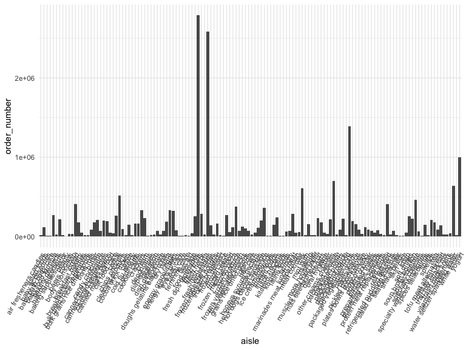
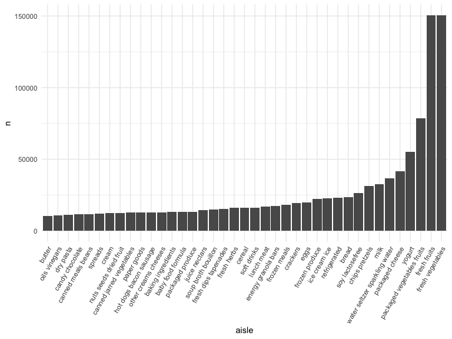
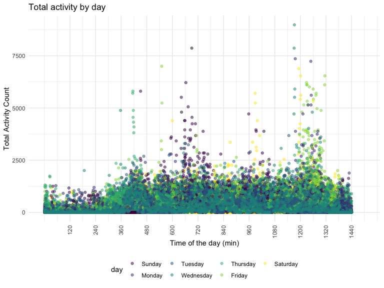

p8105_hw3_ms6360
================
Maisie Sun
2022-10-15

# Problem 1

``` r
library(p8105.datasets)
data("instacart")

colnames(instacart)
```

    ##  [1] "order_id"               "product_id"             "add_to_cart_order"     
    ##  [4] "reordered"              "user_id"                "eval_set"              
    ##  [7] "order_number"           "order_dow"              "order_hour_of_day"     
    ## [10] "days_since_prior_order" "product_name"           "aisle_id"              
    ## [13] "department_id"          "aisle"                  "department"

*Write a short description of the dataset, noting the size and structure
of the data, describing some key variables, and giving illstrative
examples of observations.*

-   This dataset is called `instacart` and has 1384617 rows and 15
    columns.

-   Variables in this dataset (order_id, product_id, add_to_cart_order,
    reordered, user_id, eval_set, order_number, order_dow,
    order_hour_of_day, days_since_prior_order, product_name, aisle_id,
    department_id, aisle, department) include information on items added
    to cart, their aisle location, and product type.

ANSWER

This dataset contains 1384617 rows and 15 columns, with each row
representing a single product from an instacart order. Variables include
identifiers for user, order, and product; the order in which each
product was added to the cart. There are several order-level variables,
describing the day and time of the order, and number of days since prior
order. Then there are several item-specific variables, describing the
product name (e.g. Yogurt, Avocado), department (e.g. dairy and eggs,
produce), and aisle (e.g. yogurt, fresh fruits), and whether the item
has been ordered by this user in the past.

-   Illstrative examples include histograms and bar plots:

``` r
ggplot(instacart, aes(x = aisle, y = order_number)) +
  geom_bar(stat = "identity") +
  theme(axis.text.x = element_text(angle = 60, hjust = 1))
```



``` r
#ANSWER
instacart %>% 
  count(aisle) %>% 
  filter(n > 10000) %>% 
  mutate(aisle = fct_reorder(aisle, n)) %>% 
  ggplot(aes(x = aisle, y = n)) + 
  geom_bar(stat = "identity") +
  theme(axis.text.x = element_text(angle = 60, hjust = 1))
```



-   This plot shows the number of orders based on each aisles that has
    more than 1000 items.

*How many aisles are there, and which aisles are the most items ordered
from?*

-   There are 134 aisles and top 3 aisles for most items ordered from
    are fresh vegetables, fresh fruits, and packaged vegetables fruits.

ANSWER

In total, there are 39123 products found in 131209 orders from 131209
distinct users.

``` r
instacart %>%
  select(aisle_id, aisle) %>% 
  group_by(aisle) %>% 
  summarize(n_product = n()) %>% 
  arrange(desc(n_product))
```

    ## # A tibble: 134 × 2
    ##    aisle                         n_product
    ##    <chr>                             <int>
    ##  1 fresh vegetables                 150609
    ##  2 fresh fruits                     150473
    ##  3 packaged vegetables fruits        78493
    ##  4 yogurt                            55240
    ##  5 packaged cheese                   41699
    ##  6 water seltzer sparkling water     36617
    ##  7 milk                              32644
    ##  8 chips pretzels                    31269
    ##  9 soy lactosefree                   26240
    ## 10 bread                             23635
    ## # … with 124 more rows

*Make a plot that shows the number of items ordered in each aisle,
limiting this to aisles with more than 10000 items ordered. Arrange
aisles sensibly, and organize your plot so others can read it.*

``` r
instacart %>%
  group_by(aisle) %>%
  summarize(n_product = n()) %>%
  filter(n_product > 10000) %>%
  mutate(aisle = reorder(aisle, -n_product)) %>% 
  ggplot(aes(x = aisle, y = n_product)) +
  geom_bar(stat = "identity") + 
  theme(axis.text.x = element_text(angle = 90, vjust = 0.5, hjust = 1))
```


``` r
#ANSWER

instacart %>% 
  count(aisle) %>% 
  filter(n > 10000) %>% 
  mutate(aisle = fct_reorder(aisle, n)) %>% 
  ggplot(aes(x = aisle, y = n)) + 
  geom_point() + 
  labs(title = "Number of items ordered in each aisle") +
  theme(axis.text.x = element_text(angle = 60, hjust = 1))
```


*Make a table showing the three most popular items in each of the aisles
“baking ingredients”, “dog food care”, and “packaged vegetables fruits”.
Include the number of times each item is ordered in your table.*

``` r
instacart %>%
  filter(aisle %in% c("baking ingredients", "dog food care", "packaged vegetables fruits")) %>%
  group_by(aisle, product_name) %>%
  summarize(product_n = n()) %>%
  arrange(desc(product_n)) %>%
  group_by(aisle) %>%
  slice(1:3)
```

    ## `summarise()` has grouped output by 'aisle'. You can override using the
    ## `.groups` argument.

    ## # A tibble: 9 × 3
    ## # Groups:   aisle [3]
    ##   aisle                      product_name                                produ…¹
    ##   <chr>                      <chr>                                         <int>
    ## 1 baking ingredients         Light Brown Sugar                               499
    ## 2 baking ingredients         Pure Baking Soda                                387
    ## 3 baking ingredients         Cane Sugar                                      336
    ## 4 dog food care              Snack Sticks Chicken & Rice Recipe Dog Tre…      30
    ## 5 dog food care              Organix Chicken & Brown Rice Recipe              28
    ## 6 dog food care              Small Dog Biscuits                               26
    ## 7 packaged vegetables fruits Organic Baby Spinach                           9784
    ## 8 packaged vegetables fruits Organic Raspberries                            5546
    ## 9 packaged vegetables fruits Organic Blueberries                            4966
    ## # … with abbreviated variable name ¹​product_n

``` r
#ANSWER

instacart %>% 
  filter(aisle %in% c("baking ingredients", "dog food care", "packaged vegetables fruits")) %>%
  group_by(aisle) %>% 
  count(product_name) %>% 
  mutate(rank = min_rank(desc(n))) %>% 
  filter(rank < 4) %>% 
  arrange(desc(n)) %>%
  knitr::kable()
```

| aisle                      | product_name                                  |    n | rank |
|:---------------------------|:----------------------------------------------|-----:|-----:|
| packaged vegetables fruits | Organic Baby Spinach                          | 9784 |    1 |
| packaged vegetables fruits | Organic Raspberries                           | 5546 |    2 |
| packaged vegetables fruits | Organic Blueberries                           | 4966 |    3 |
| baking ingredients         | Light Brown Sugar                             |  499 |    1 |
| baking ingredients         | Pure Baking Soda                              |  387 |    2 |
| baking ingredients         | Cane Sugar                                    |  336 |    3 |
| dog food care              | Snack Sticks Chicken & Rice Recipe Dog Treats |   30 |    1 |
| dog food care              | Organix Chicken & Brown Rice Recipe           |   28 |    2 |
| dog food care              | Small Dog Biscuits                            |   26 |    3 |

*Make a table showing the mean hour of the day at which Pink Lady Apples
and Coffee Ice Cream are ordered on each day of the week; format this
table for human readers (i.e. produce a 2 x 7 table).*

``` r
instacart %>%
  filter(product_name %in% c("Pink Lady Apples", "Coffee Ice Cream")) %>%
  select(product_name, order_hour_of_day, order_dow) %>%
  group_by(product_name, order_dow) %>%
  summarize( 
    mean_order = mean(order_hour_of_day)) %>%
  mutate(order_dow = recode(order_dow, "0" = "Sunday", "1" = "Monday", "2" = "Tuesday", "3" = "Wednesday", "4" = "Thursday", "5" = "Friday", "6" = "Saturday")) %>%
  pivot_wider(
    names_from = "order_dow", 
    values_from = "mean_order"
  )
```

    ## `summarise()` has grouped output by 'product_name'. You can override using the
    ## `.groups` argument.

    ## # A tibble: 2 × 8
    ## # Groups:   product_name [2]
    ##   product_name     Sunday Monday Tuesday Wednesday Thursday Friday Saturday
    ##   <chr>             <dbl>  <dbl>   <dbl>     <dbl>    <dbl>  <dbl>    <dbl>
    ## 1 Coffee Ice Cream   13.8   14.3    15.4      15.3     15.2   12.3     13.8
    ## 2 Pink Lady Apples   13.4   11.4    11.7      14.2     11.6   12.8     11.9

``` r
#ANSWER

instacart %>%
  filter(product_name %in% c("Pink Lady Apples", "Coffee Ice Cream")) %>%
  group_by(product_name, order_dow) %>%
  summarize(mean_hour = mean(order_hour_of_day)) %>%
  spread(key = order_dow, value = mean_hour) %>%
  knitr::kable(digits = 2)
```

    ## `summarise()` has grouped output by 'product_name'. You can override using the
    ## `.groups` argument.

| product_name     |     0 |     1 |     2 |     3 |     4 |     5 |     6 |
|:-----------------|------:|------:|------:|------:|------:|------:|------:|
| Coffee Ice Cream | 13.77 | 14.32 | 15.38 | 15.32 | 15.22 | 12.26 | 13.83 |
| Pink Lady Apples | 13.44 | 11.36 | 11.70 | 14.25 | 11.55 | 12.78 | 11.94 |

# Problem 2

Import and clean the dataset

*Load, tidy, and otherwise wrangle the data. Your final dataset should
include all originally observed variables and values; have useful
variable names; include a weekday vs weekend variable; and encode data
with reasonable variable classes. Describe the resulting dataset
(e.g. what variables exist, how many observations, etc).*

``` r
accel = 
  read_csv("./data/accel_data.csv") %>%
    janitor::clean_names() %>%
  mutate(
    weekend_weekday = ifelse(day %in% c("Sunday", "Saturday"), "Weekend","Weekday"),
    week = as.integer(week),
    day_id = as.integer(day_id)) %>%
  select(week, day_id, weekend_weekday, day, everything()) %>%
  pivot_longer(
    activity_1:activity_1440, 
    names_to = "activity_min",
    names_prefix = "activity_",
    values_to = "activity")
```

    ## Rows: 35 Columns: 1443
    ## ── Column specification ────────────────────────────────────────────────────────
    ## Delimiter: ","
    ## chr    (1): day
    ## dbl (1442): week, day_id, activity.1, activity.2, activity.3, activity.4, ac...
    ## 
    ## ℹ Use `spec()` to retrieve the full column specification for this data.
    ## ℹ Specify the column types or set `show_col_types = FALSE` to quiet this message.

This dataset contains 50400 rows and 6 columns, with each row
representing a single actvity entry from a 63 year-old male with BMI 25,
who was admitted to the Advanced Cardiac Care Center of Columbia
University Medical Center and diagnosed with congestive heart failure
(CHF). Variables include week number, day, activity time, and activity
length.

There are several order-level variables, describing the week and day of
the week of the activity. Then there are several character variables,
such as the day of the week or whether it is a weekend or not.

*Traditional analyses of accelerometer data focus on the total activity
over the day. Using your tidied dataset, aggregate across minutes to
create a total activity variable for each day, and create a table
showing these totals. Are any trends apparent?*

``` r
accel_activity =
  accel %>%
  mutate(day = factor(day, levels = c('Sunday', 'Monday', 'Tuesday', 'Wednesday', 'Thursday','Friday', 'Saturday'))) %>%
  group_by(day, week) %>% 
  summarize(total_activity = sum(activity)) %>%
  pivot_wider(names_from = day,
              values_from = total_activity)
```

    ## `summarise()` has grouped output by 'day'. You can override using the `.groups`
    ## argument.

-   According to the table, the individual did not exercise on Saturday
    of week 4 and 5. His activity level on Sunday decreased throughout
    the weeks. His activity level is maintained and changes little for
    Tuesday, Wednesday, and Thursday. Monday and Friday activity levels
    differs slight throughout the weeks.

-   Total activity decreased at the beginning of the week (Sunday,
    Monday, Tuesday) and has a sharp increase on Wednesday, and high
    total activity level is maintained on Thursday and Friday. Saturday
    seems to be a rest day, where the total activity level lowers.

*Accelerometer data allows the inspection activity over the course of
the day. Make a single-panel plot that shows the 24-hour activity time
courses for each day and use color to indicate day of the week. Describe
in words any patterns or conclusions you can make based on this graph.*

``` r
activity_plot = 
  accel %>%
   mutate(day = factor(day, levels = c('Sunday', 'Monday', 'Tuesday', 'Wednesday', 'Thursday','Friday', 'Saturday')),
          activity_min = as.numeric(activity_min)) %>%
  ggplot(aes(x = activity_min, y = activity, color = day)) + 
  geom_point(alpha = 0.5) +
  theme(axis.text.x = element_text(angle = 90, vjust = 0.5, hjust = 1)) +
  scale_x_continuous(
    breaks = c(120, 240, 360, 480, 600, 720, 840, 960, 1080, 1200, 1320, 1440),
    limits = c(1, 1500)) +
    labs(
    title = "Total activity by day",
    x = "Time of the day (min)",
    y = "Total Activity Count")

activity_plot
```



``` r
ggsave("result/activity_plot.pdf", activity_plot, width = 20, height = 10)
```

-   This plot shows activity throughout the day in minutes and the
    amount of activity that the patient performed in that minute. I used
    a scatterplot to clearly show activity at different times of the
    day, separated by colors, representing each day of the week.

-   Overall, there is little activity in the first 6 hours of the day,
    mostly likely due to sleep. The same can be said for the last 4
    hours of the day.

-   Throughout the week, morning activity happens on Thursday at 7am. On
    Friday, at 9am, and on Sunday at 11am. In the evening, activity
    happens on Saturday and Sunday at 5pm. From 8pm to 10pm, activity
    occurs on Monday, Wednesday, Thursday, Friday, and Saturday.

# Problem 3

``` r
library(p8105.datasets)
data("ny_noaa")

prcp_percent =
  ny_noaa %>% 
  filter(is.na(prcp)) %>% 
  count/nrow(ny_noaa)*100
snow_percent =
  ny_noaa %>% 
  filter(is.na(snow)) %>% 
  count/nrow(ny_noaa)*100
snwd_percent =
  ny_noaa %>% 
  filter(is.na(snwd)) %>% 
  count/nrow(ny_noaa)*100
tmax_percent =
  ny_noaa %>% 
  filter(is.na(tmax)) %>% 
  count/nrow(ny_noaa)*100
tmin_percent =
  ny_noaa %>% 
  filter(is.na(tmin)) %>% 
  count/nrow(ny_noaa)*100
```

*Write a short description of the dataset, noting the size and structure
of the data, describing some key variables, and indicating the extent to
which missing data is an issue.*

This dataset contains 2595176 rows and 7 columns, with each row
representing a single daily observation from a weather station in the
US. Variables include station ID, date of observation, precipitation,
snowfall, snow depth, max temperature and min temperature.

There are several variables that should be order-level, describing the
date. there are also variables that should be numeric such as the
observations (snowfall, snow depth, max temperature, and min
temperature). There are also many rows where data is missing, especially
for precipitation, seeing that only half of the stations report
precipitation.

There are 145838 (5.62%) observations missing for precipitation. There
are 381221 (14.69%) observations missing for snowfall There are 591786
(22.8%) observations missing for snow depth There are 1134358 (43.71%)
observations missing for max temperature There are 1134420 (43.71%)
observations missing for min temperature.

*Do some data cleaning. Create separate variables for year, month, and
day. Ensure observations for temperature, precipitation, and snowfall
are given in reasonable units. For snowfall, what are the most commonly
observed values? Why?*

``` r
clean_data = 
  ny_noaa %>%
  janitor::clean_names() %>%
  separate(date, into = c("year", "month", "day"), sep = "-") %>%
  mutate(
    prcp = prcp/10,
    tmax = as.numeric(tmax)/10,
    tmin = as.numeric(tmin)/10,
    month = recode(month, "01" = "January", "02" = "February", "03" = "March", "04" = "April", "05" = "May", "06" = "June", "07" = "July", "08" = "August", "09" = "September", "10" = "October", "11" = "November", "12" = "December"))
```

-   Variables were converted into standard units. `prcp` was measured in
    tenths of mm and was converted into mm. `tmax` and `tmin` were
    measured in tenths of degrees C and were converted into degrees C.

-   For snowfall, it is measured in mm. The most common value is 2008508

*Make a two-panel plot showing the average max temperature in January
and in July in each station across years. Is there any observable /
interpretable structure? Any outliers?*

``` r
panel_plot = 
  clean_data %>%
  select(id, year, month, day, tmax, tmin) %>%
  filter(month == "January" | month == "July") %>%
  group_by(id, year, month) %>%
  summarize(
    mean_tmax = mean(tmax, na.rm = TRUE)) %>%
  drop_na(mean_tmax)
```

    ## `summarise()` has grouped output by 'id', 'year'. You can override using the
    ## `.groups` argument.

``` r
jan_panel = 
  panel_plot %>% 
  filter(month == "January") %>%
  ggplot(aes(x = year, y = mean_tmax)) + 
  geom_point(aes(color = id), alpha = .5) + 
  theme(legend.position = "none") + 
  theme(axis.text.x = element_text(angle = 90, vjust = 0.5, hjust = 1)) +
  labs(
    title = "Mean max tempreture according to NY weather stations in January from 1991 to 2010",
    x = "Mean max temperature (C)",
    y = "Year") +
  scale_y_continuous(
    breaks = c(-20, -10, 0, 10, 20, 30), 
    limits = c(-20, 30))

july_panel = 
  panel_plot %>% 
  filter(month == "July") %>%
  ggplot(aes(x = year, y = mean_tmax)) + 
  geom_point(aes(color = id), alpha = .5) + 
  theme(legend.position = "none") + 
  theme(axis.text.x = element_text(angle = 90, vjust = 0.5, hjust = 1)) +
  labs(
    title = "Mean max tempreture according to NY weather stations in July from 1991 to 2010",
    x = "Mean max temperature (C)",
    y = "Year") +
  scale_y_continuous(
    breaks = c(-20, -10, 0, 10, 20, 30), 
    limits = c(-20, 30))

mean_max_temp = (jan_panel + july_panel)

ggsave("result/mean_max_temp.pdf", mean_max_temp, width = 20, height = 10)
```

-   Overall, the mean max temperature in July is a lot higher than
    January, which is expected. The mean max temperature for July across
    the years is 26.9381965 while the mean max temperature for January
    across the years is -0.2503873.

-   There seems to an outlier for weather station ID USC00308962,
    obervation on 1988, July. The mean max temperature was 13.95C, which
    is a lot lower than any other mean max temperatures.

*Make a two-panel plot showing (i) tmax vs tmin for the full dataset
(note that a scatterplot may not be the best option); and (ii) make a
plot showing the distribution of snowfall values greater than 0 and less
than 100 separately by year.*

``` r
tmax_tmin =
  clean_data %>%
  ggplot(aes(x = tmax, y = tmin)) + 
  geom_hex() +
  theme(legend.position = "bottom") +
    labs(
      title = "Maximum vs minimum temperatures from 1991 to 2010 across all weather stations in the US",
      x = "Max temperature (C)",
      y = "Min temperature (C)") +
  theme(legend.text = element_text(angle = 90, vjust = 0.5, hjust = 1)) +
  scale_x_continuous(
    breaks = c(-30, -30, -10, 0, 10, 20, 30, 40, 50, 60), 
    limits = c(-30, 65))

snowfall =
  clean_data %>%
  select(id, year, snow) %>%
  filter(snow > 0 & snow < 100) %>%
  drop_na(snow) %>%
  ggplot(aes(x = year, y = snow)) + 
  geom_boxplot() +
  theme(legend.position = "none") +
  theme(axis.text.x = element_text(angle = 90, vjust = 0.5, hjust = 1))

two_panel_plots = (tmax_tmin + snowfall)

ggsave("result/two_panel_plots.pdf", two_panel_plots, width = 20, height = 10)
```
